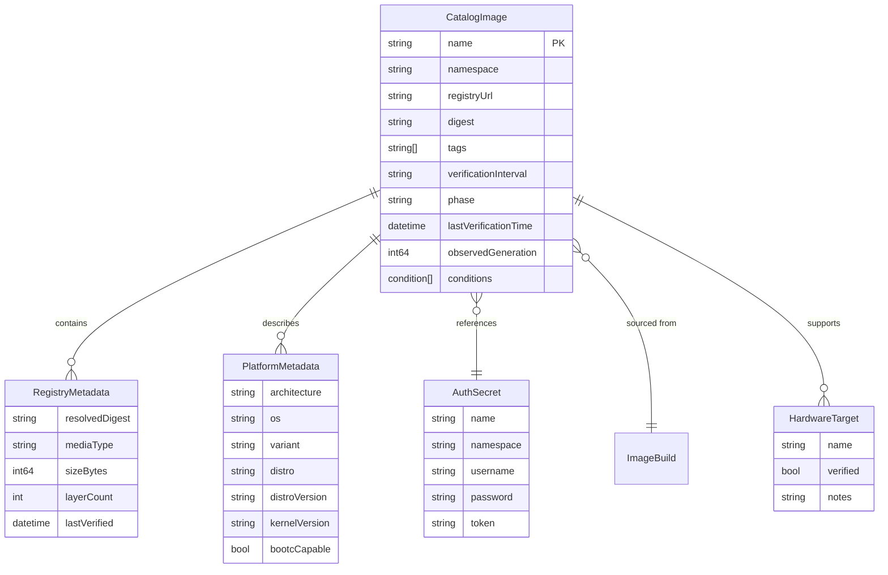
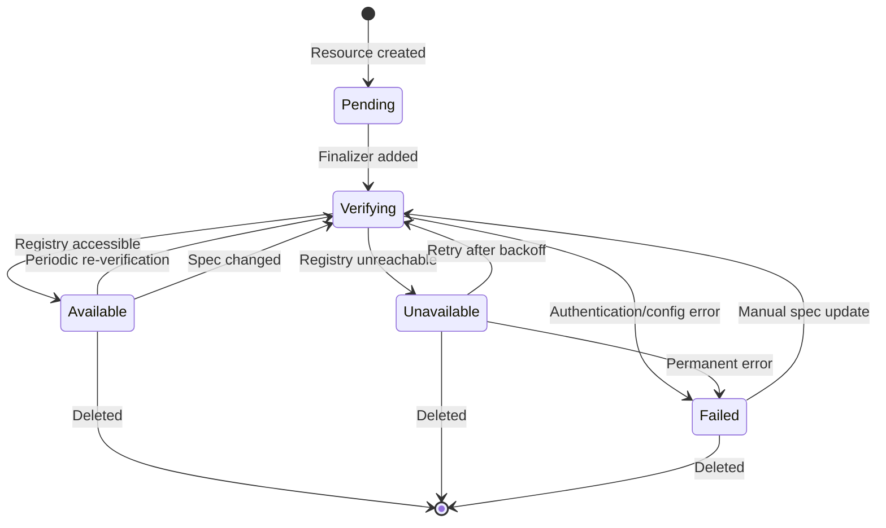

# Data Model: Image Catalog

**Date**: 2026-01-04
**Feature**: Image Catalog Backend System

## Entity Relationships



## Core Entities

### CatalogImage (Custom Resource)

The primary entity representing a published automotive OS image in the catalog.

**Spec Fields**:
```yaml
spec:
  registryUrl: "quay.io/centos-automotive/autosd:cs9-rpi4-v1.0.0"
  digest: "sha256:abc123..."  # Optional, for immutable references
  tags: ["production", "automotive", "embedded"]
  authSecretRef:
    name: "quay-credentials"
    namespace: "default"  # Optional, defaults to CatalogImage namespace
  verificationInterval: "1h"  # How often to verify registry accessibility
  metadata:
    architecture: "arm64"
    distro: "cs9"
    distroVersion: "9.4"
    targets:
      - name: "raspberry-pi"
        verified: true
        notes: "Tested on Pi 4 Model B (8GB)"
    kernelVersion: "6.1.0-rt"
    bootcCapable: true
```

**Status Fields**:
```yaml
status:
  observedGeneration: 5
  phase: "Available"  # Pending, Verifying, Available, Unavailable, Failed
  conditions:
    - type: "Available"
      status: "True"
      reason: "RegistryAccessible"
      message: "Image is accessible in registry"
      lastTransitionTime: "2026-01-04T13:00:00Z"
  registryMetadata:
    resolvedDigest: "sha256:def456..."
    mediaType: "application/vnd.docker.distribution.manifest.v2+json"
    sizeBytes: 2147483648
    layerCount: 15
    platform:
      architecture: "arm64"
      os: "linux"
  lastVerificationTime: "2026-01-04T13:00:00Z"
  accessCount: 42
```

### RegistryMetadata (Embedded Type)

Contains metadata extracted from the container registry about the image.

**Fields**:
- `resolvedDigest`: The actual digest resolved from tags
- `mediaType`: OCI manifest media type
- `sizeBytes`: Total size of image layers
- `layerCount`: Number of layers in the image
- `platform`: Architecture and OS information
- `lastVerified`: When metadata was last extracted

### PlatformMetadata (Embedded Type)

Automotive-specific platform and build information.

**Fields**:
- `architecture`: CPU architecture (`amd64`, `arm64`)
- `os`: Operating system (`linux`)
- `variant`: Architecture variant (e.g., `v7` for armv7)
- `distro`: Distribution identifier (`cs9`, `autosd10-sig`)
- `distroVersion`: Distribution version (`9.4`)
- `kernelVersion`: Kernel version included in image
- `bootcCapable`: Whether this is a bootc-compatible image

### HardwareTarget (Embedded Type)

Represents a hardware platform that the image supports.

**Fields**:
- `name`: Target identifier (`qemu`, `raspberry-pi`, `beaglebone`)
- `verified`: Whether the image has been tested on this target
- `notes`: Target-specific information or testing notes

## Validation Rules

### CatalogImage Validation

**Required Fields**:
- `spec.registryUrl`: Must be a valid container image reference
- `metadata.name`: Must be valid Kubernetes resource name

**Format Validation**:
```go
// +kubebuilder:validation:Required
// +kubebuilder:validation:Pattern=`^([a-z0-9]+(-[a-z0-9]+)*\.)+[a-z]{2,}(:[0-9]{1,5})?/.*$`
RegistryURL string `json:"registryUrl"`

// +kubebuilder:validation:Pattern=`^sha256:[a-f0-9]{64}$`
// +optional
Digest string `json:"digest,omitempty"`

// +kubebuilder:default="1h"
// +kubebuilder:validation:Pattern=`^([0-9]+(\.[0-9]+)?(ns|us|µs|ms|s|m|h))+$`
VerificationInterval string `json:"verificationInterval,omitempty"`
```

**Enum Validation**:
```go
// +kubebuilder:validation:Enum=Pending;Verifying;Available;Unavailable;Failed
Phase string `json:"phase,omitempty"`

// +kubebuilder:validation:Enum=amd64;arm64;x86_64;aarch64
Architecture string `json:"architecture"`

// +kubebuilder:validation:Enum=bootc;image;package
BuildMode string `json:"buildMode,omitempty"`
```

## State Transitions

### CatalogImage Lifecycle



**State Descriptions**:
- **Pending**: Initial state, finalizer being added
- **Verifying**: Controller checking registry accessibility
- **Available**: Image is accessible and metadata extracted
- **Unavailable**: Temporary registry issue, will retry
- **Failed**: Permanent error requiring user intervention

## Indexing Strategy

### Primary Indexes

For efficient catalog queries, the following fields will be indexed:

```go
// Registry URL for duplicate detection
"spec.registryUrl": catalogImage.Spec.RegistryURL

// Digest for content-addressable lookups
"spec.digest": catalogImage.Spec.Digest

// Phase for status filtering
"status.phase": catalogImage.Status.Phase

// Tags for multi-value queries
"spec.tags": catalogImage.Spec.Tags  // Returns all tags as separate index entries
```

### Label-Based Indexes

For external queries via kubectl and API:

```yaml
metadata:
  labels:
    automotive.sdv.cloud.redhat.com/architecture: "arm64"
    automotive.sdv.cloud.redhat.com/distro: "cs9"
    automotive.sdv.cloud.redhat.com/target: "raspberry-pi"
    automotive.sdv.cloud.redhat.com/bootc-capable: "true"
    automotive.sdv.cloud.redhat.com/registry-type: "openshift-internal"
    automotive.sdv.cloud.redhat.com/source-type: "imagebuild"
```

## Data Consistency Rules

### Uniqueness Constraints

**Registry URL**: While not enforced by CRD validation, the controller should prevent duplicate entries for the same `registryUrl` within a namespace.

**Digest References**: Multiple CatalogImages can reference the same digest (different tags for same image), but should share metadata.

### Metadata Synchronization

**Registry Metadata**: Updated during verification cycles, not user-modifiable
**Platform Metadata**: Can be set by user but should be validated against registry metadata when available
**Status Conditions**: Managed exclusively by controller using standard Kubernetes condition patterns

### Conflict Resolution

**Spec vs Registry Mismatch**: If user-provided metadata conflicts with registry metadata, controller should:
1. Log warning event
2. Update status condition with mismatch details
3. Prefer registry metadata for accuracy
4. Allow user metadata as override if explicitly marked

## Storage Considerations

### Etcd Storage

**Size Optimization**:
- Limit annotation size to prevent etcd bloat
- Store large metadata (OSBuild manifests) as referenced ConfigMaps
- Use status subresource to separate frequently-changing data

**Performance**:
- Field indexes reduce query latency from O(n) to O(log n)
- Status-only updates don't trigger spec reconciliation
- Separate status writer prevents spec/status conflicts

### External Storage

**Registry Metadata Cache**: Optional ConfigMap-based cache for:
- Frequently accessed metadata
- Offline operation support
- Cross-namespace metadata sharing

**Build Artifacts**: Link to existing Image CRs for full build traceability